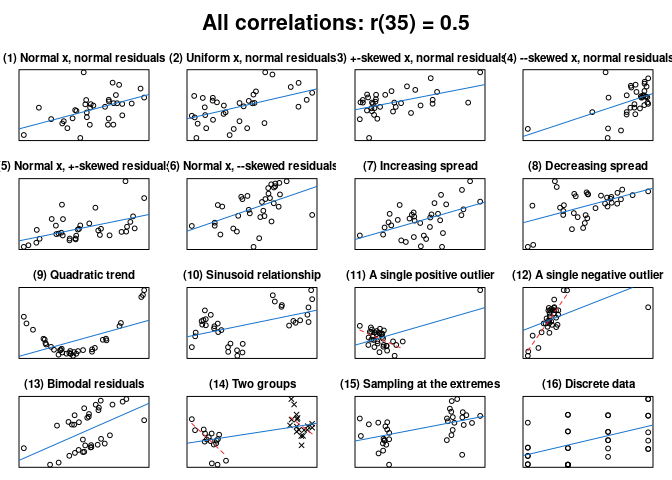
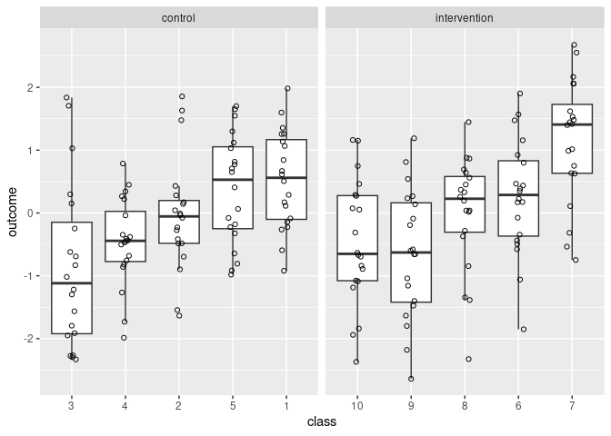
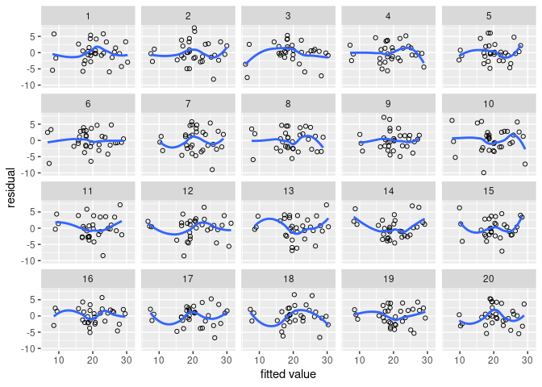

<!-- README.md is generated from README.Rmd. Please edit that file -->
cannonball
==========

cannonball bundles a couple of functions that I use when teaching introductory courses in quantitative methodology and statistics.

Installation
------------

You can install cannonball from Github with:

``` r
library(devtools)
install_github("janhove/cannonball")
```

Functions
---------

``` r
# Load the package
library(cannonball)
```

### `plot_r()`: Draw different scatterplots with the same correlation coefficient

A single correlation coefficient can correspond to any number of scatterplots. `plot_r()` produces 16 such scatterplots for any given Pearson correlation coefficient to drive this point home.

``` r
plot_r(r = 0.5, n = 35)
```



For more info, see `?plot_r`.

Accompanying blog post: [*What data patterns can lie behind a correlation coefficient?*](https://janhove.github.io/teaching/2016/11/21/what-correlations-look-like)

### Walkthroughs

To help students see the connection between an experiment's design and its analysis, I've written two functions.

`walkthrough_p()` guides the user through a completely randomised experiment: Data points are generated and randomly assigned to either the control or intervention condition. Then, the intervention effect is added to the data points in the intervention condition. Finally, the data are analysed using a Student's t-test or, if `pedant = TRUE`, a permutation test.

``` r
# see ?walkthrough_p
walkthrough_p(n = 18, diff = 0.3, sd = 1, pedant = TRUE)
```

`walkthrough_blocking()` works similarly to `walkthrough_p()` but describes a randomised block design: Prior information about the data points is available in the form of a covariate (e.g., a pretest score). This information is used to group participants into 'blocks', and the randomisation is restricted in that one participant per block is assigned to the control and one to the intervention condition. Crucially, the analysis needs to take this restricted randomisation into account.

``` r
# ?walkthrough_blocking
walkthrough_blocking(n = 12, diff = 0.4, sd = 1)
```

An alternative, more powerful, but less easily explained analysis would use the blocking *covariate* as a control variable in a general linear model rather than the blocking *factor*.

### Simulate data for cluster-randomised experiment

The data from experiments in which entire clusters of participants (e.g., classes) are assigned to the experimental conditions can't be analysed in the same way as data from experiments in which the participants are assigned to the conditions individually. `clustered_data()` generates data for a cluster-randomised experiment and can be used to demonstrate the increased Type-I error rate if such data are analysed using t-tests on the individual outcomes.

``` r
# Simulate clustered data with an ICC of 0.3
d <- clustered_data(ICC = 0.3)

# Plot
library(ggplot2)
ggplot(data = d,
       aes(x = reorder(class, outcome, FUN = median),
           y = outcome)) +
  geom_boxplot(outlier.shape = NA) +
  geom_point(shape = 1,
             position = position_jitter(width = 0.1, height = 0)) +
  facet_wrap(~ condition, scales = "free_x") +
  xlab("class")
```



A covariate can also be created. For more info, see `?clustered_data`.

Accompanying article: Vanhove, Jan. 2015. [Analyzing randomized controlled interventions: Three notes for applied linguists](http://doi.org/10.14746/ssllt.2015.5.1.7). *Studies in Second Language Learning and Teaching* 5(1). 135–152. (See the [correction note](http://pressto.amu.edu.pl/index.php/ssllt/article/view/5827/5895) for this paper.)

Accompanying blog post: [*Experiments with intact groups: spurious significance with improperly weighted t-tests*](https://janhove.github.io/design/2016/02/16/cluster-randomisation-correction).

### Check model assumptions graphically

These functions may be helpful for helping you to judge whether your data conform to the assumptions of your statistical model. By embedding the model's diagnostic plot in a line-up of diagnostic plots of simulated data for which the model's assumptions are literally met, analysts can more easily determine whether any blips in these plots are indicative of assumption violations or whether they can plausibly be accounted for by sampling error/noise. See [Buja et al. (2009)](http://doi.org/10.1098/rsta.2009.0120).

``` r
# Fit model
m <- lm(mpg ~ wt, data = mtcars)

# Create parade/line-up
my_parade <- parade(m)
#> Loading required package: tidyverse
#> ── Attaching packages ────────────────────────────────── tidyverse 1.2.1 ──
#> ✔ tibble  2.1.3     ✔ purrr   0.3.2
#> ✔ tidyr   1.0.0     ✔ dplyr   0.8.3
#> ✔ readr   1.3.1     ✔ stringr 1.4.0
#> ✔ tibble  2.1.3     ✔ forcats 0.4.0
#> ── Conflicts ───────────────────────────────────── tidyverse_conflicts() ──
#> ✖ dplyr::filter() masks stats::filter()
#> ✖ dplyr::lag()    masks stats::lag()

# Check for residual nonlinearities:
# Which plot looks most different from the rest?
lin_plot(my_parade)
#> `geom_smooth()` using method = 'loess' and formula 'y ~ x'
```



``` r

# Reveal position of actual diagnostic plot
reveal(my_parade)
#> The true data are in position 14.
```

Related functions are:

-   `var_plot()`: Check for non-constant variance in the residuals.
-   `norm_qq()`: Check for non-normality of the residuals (quantile--quantile plot).
-   `norm_hist()`: Check for non-normality of the residuals (histogram).
-   `parade_summary()`: Summarise residuals per cell (combination of unique predictor values).

Accompanying article: Vanhove, Jan. 2018. [Checking the assumptions of your statistical model without getting paranoid](https://psyarxiv.com/zvawb/). Preprint on PsyArxiv.
