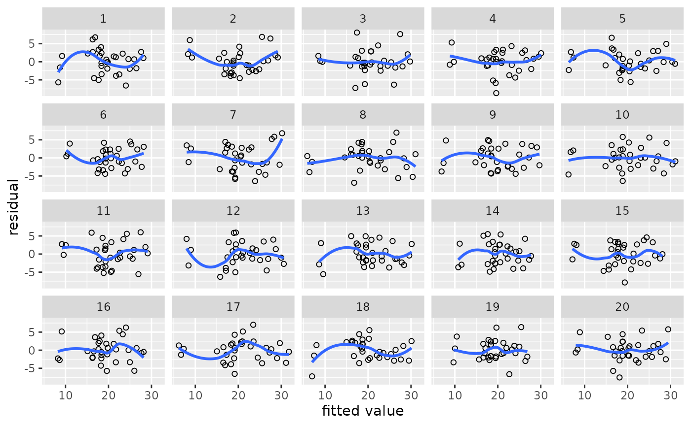
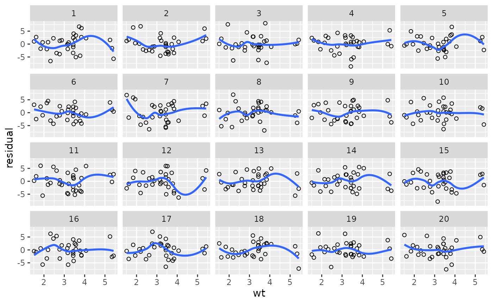
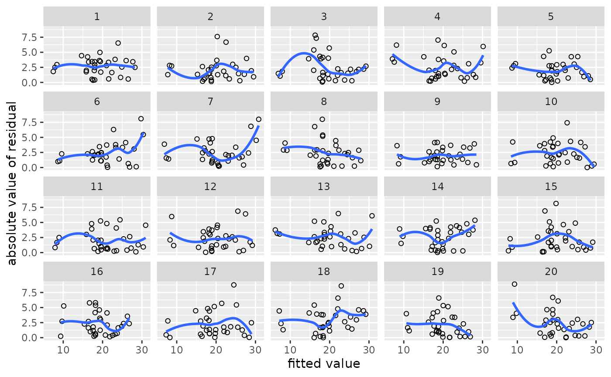
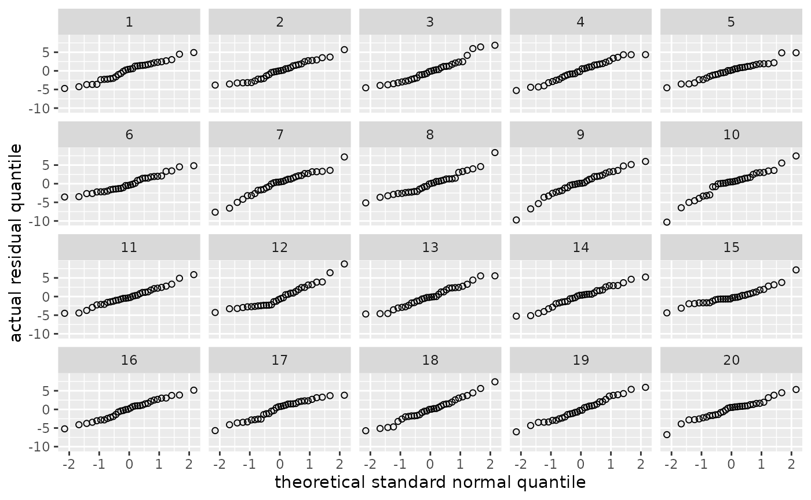
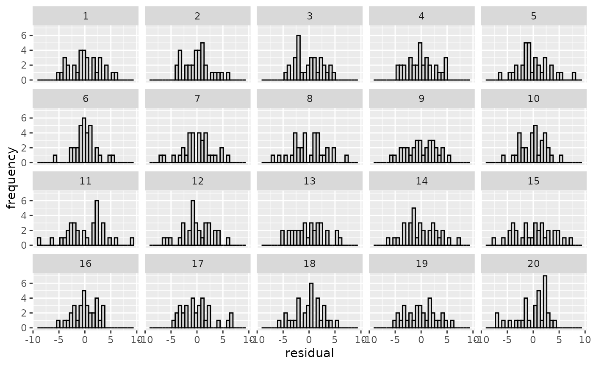
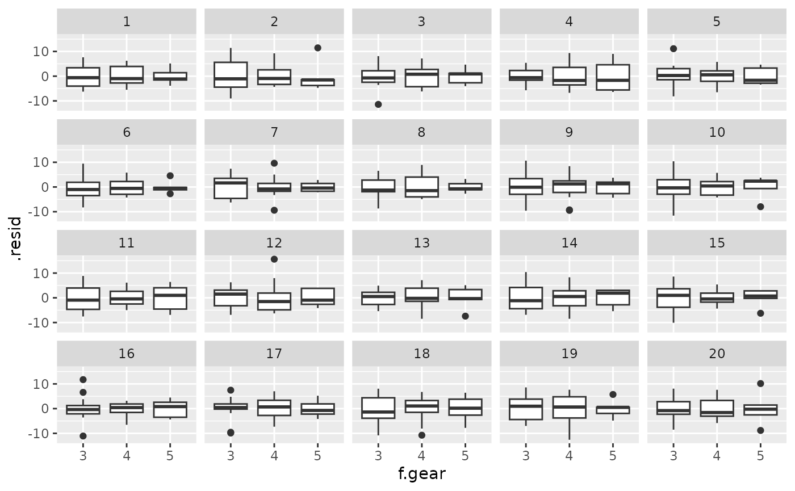
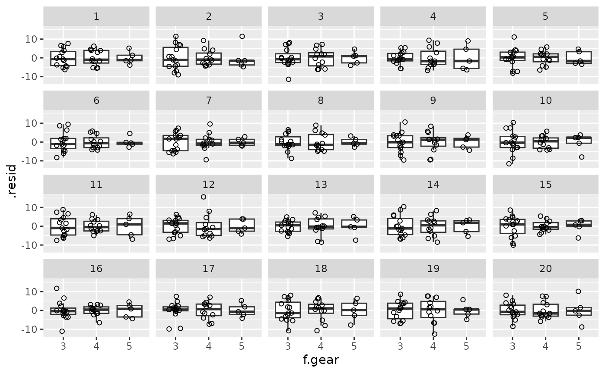
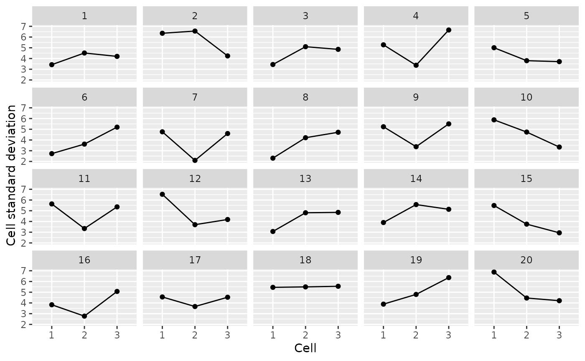

# Graphically checking model assumptions

The `cannonball` package contains a handful of functions that can help
you judge whether your data conform to the assumptions of the
statistical model you’ve fitted. By embedding the model’s diagnostic
plot in a line-up of diagnostic plots of simulated data for which the
model’s assumptions are literally met, you can more easily determine
whether any blips in these plots are indicative of assumption violations
or whether they can plausibly be accounted for by sampling error or
noise. The idea for this stems from [Buja et
al. (2009)](http://doi.org/10.1098/rsta.2009.0120) and is similar to
posterior predictive checks in Bayesian statistics; see [Vanhove
(2018)](https://doi.org/10.31234/osf.io/zvawb) for an accompanying
article.

## Example with numeric predictors

Load the package and fit a simple regression model.

``` r

library(cannonball)

m <- lm(mpg ~ wt, data = mtcars)
```

Using
[`parade()`](https://janhove.github.io/cannonball/reference/parade.md),
create a parade in which the real dataset is hidden among 19 other
datasets generated from the model. For these other datasets, the model’s
assumptions are literally met.

``` r

my_parade <- parade(m)
```

The parade is itself a tibble/data frame:

``` r

my_parade
#> # A tibble: 640 × 7
#>       wt   mpg .fitted .resid .abs_resid .sqrt_abs_resid .sample
#>    <dbl> <dbl>   <dbl>  <dbl>      <dbl>           <dbl>   <int>
#>  1  2.62  19.0    22.5 -3.49       3.49            1.87        1
#>  2  2.88  22.7    21.2  1.48       1.48            1.21        1
#>  3  2.32  17.5    24.0 -6.57       6.57            2.56        1
#>  4  3.22  20.1    19.5  0.586      0.586           0.765       1
#>  5  3.44  20.8    18.4  2.43       2.43            1.56        1
#>  6  3.46  22.3    18.3  4.03       4.03            2.01        1
#>  7  3.57  12.7    17.7 -5.05       5.05            2.25        1
#>  8  3.19  19.5    19.6 -0.144      0.144           0.379       1
#>  9  3.15  19.7    19.8 -0.123      0.123           0.351       1
#> 10  3.44  18.0    18.4 -0.322      0.322           0.567       1
#> # ℹ 630 more rows
```

A handful of convenience functions are available for gauging how much
the true dataset stands out from the simulated ones. For instance,
[`lin_plot()`](https://janhove.github.io/cannonball/reference/diagnostic_plot.md)
can be used to check if the linearity assumption is met. It plots the
residuals against the fitted values; ideally, there should be no
residual trend in the plot.

Which of the plots below looks most different from the rest?

``` r

lin_plot(my_parade)
#> `geom_smooth()` using method = 'loess' and formula = 'y ~ x'
```



In nineteen of the above plots, the linearity assumption is literally
met yet the scatterplot smoothers (LOESS fits in this case) are all
nonlinear to some extent. If the true relationship were linear, there
should only be a one-in-twenty chance that the plot you picked is the
one with the true data.

Using
[`reveal()`](https://janhove.github.io/cannonball/reference/reveal.md),
you can check your guess:

``` r

reveal(my_parade)
#> The true data are in position 2.
```

You can also plot the residuals against a predictor like so:

``` r

lin_plot(my_parade, "wt")
#> `geom_smooth()` using method = 'loess' and formula = 'y ~ x'
```



Related functions are:

- [`var_plot()`](https://janhove.github.io/cannonball/reference/diagnostic_plot.md):
  Check for non-constant variance in the residuals.
- [`norm_qq()`](https://janhove.github.io/cannonball/reference/diagnostic_plot.md):
  Check for non-normality of the residuals using a quantile–quantile
  plot.
- [`norm_hist()`](https://janhove.github.io/cannonball/reference/diagnostic_plot.md):
  Check for non-normality of the residuals using a histogram.

``` r

my_parade <- parade(m)
var_plot(my_parade)
#> `geom_smooth()` using method = 'loess' and formula = 'y ~ x'
```



``` r

# reveal(my_parade) # check

my_parade <- parade(m)
norm_qq(my_parade)
```



``` r

# reveal(my_parade)

my_parade <- parade(m)
norm_hist(my_parade)
```



``` r

# reveal(my_parade)
```

## Example with categorical predictors

If you’re working with categorical predictors, the standard
[`var_plot()`](https://janhove.github.io/cannonball/reference/diagnostic_plot.md)
is a bit difficult to read. One option is to draw, say, boxplots per
cell:

``` r

mtcars$f.gear <- factor(mtcars$gear)
m <- lm(mpg ~ f.gear, data = mtcars)
my_parade <- parade(m)


library(ggplot2)
my_parade |> 
  ggplot(aes(x = f.gear, y = .resid)) +
  geom_boxplot() +
  facet_wrap(vars(.sample))
```



``` r


# or even
my_parade |> 
  ggplot(aes(x = f.gear, y = .resid)) +
  geom_boxplot(outlier.shape = NA) +
  geom_point(shape = 1, position = position_jitter(width = 0.2, height = 0)) +
  facet_wrap(vars(.sample))
```



Alternatively, or additionally,
[`parade_summary()`](https://janhove.github.io/cannonball/reference/parade_summary.md)
can be used to compute summary statistics of the residuals per cell;
[`var_plot()`](https://janhove.github.io/cannonball/reference/diagnostic_plot.md)
can then plot these. This is particularly useful if the outcome variable
is pretty coarse: Without the by-cell averaging, you would be able to
identify the true data based not on violations of the homoskedasticity
assumptions but based on the fairly coarse nature of the data.

``` r

my_parade |> 
  parade_summary() |> 
  var_plot()
#> Warning in parade_summary(my_parade): The outcome variable (mpg) contains 25
#> unique values. Perhaps you can draw standard diagnostic plots instead of
#> averaging the residuals?
```



## References

Buja, Andreas, Dianne Cook, Heike Hofmann, Michael Lawrence, Eun-Kyung
Lee, Deborah F. Swayne and Hadley Wickham. 2009. [Statistical inference
for exploratory data analysis and model
diagnostics.](http://doi.org/10.1098/rsta.2009.0120) *Philosophical
Transactions of the Royal Society A* 367(1906). 4361–4383.

Vanhove, Jan. 2018. [Checking the assumptions of your statistical model
without getting paranoid](https://doi.org/10.31234/osf.io/zvawb).
Preprint on PsyArxiv.
