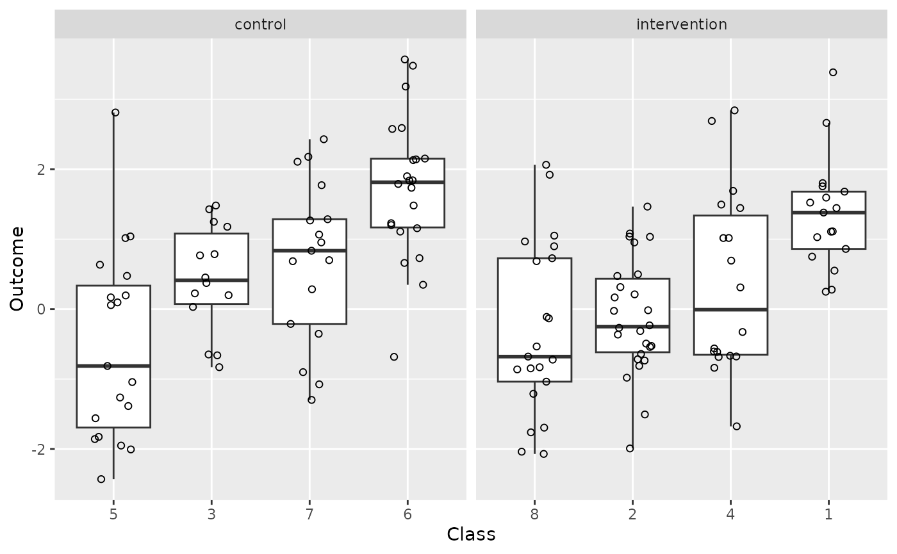
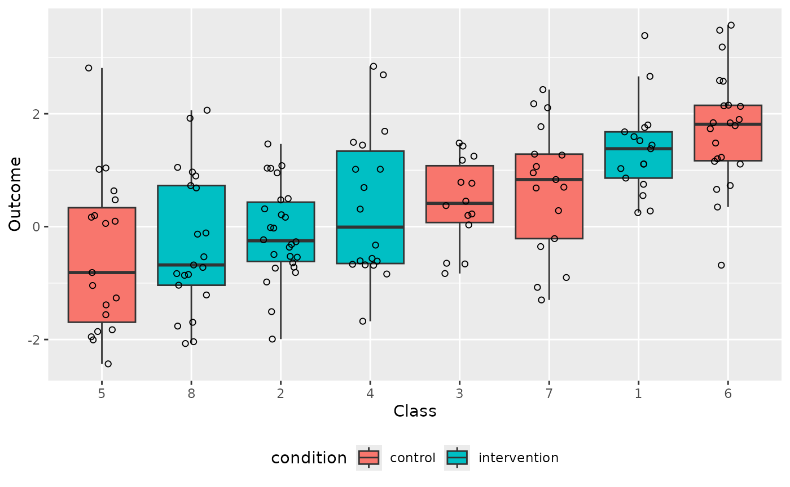
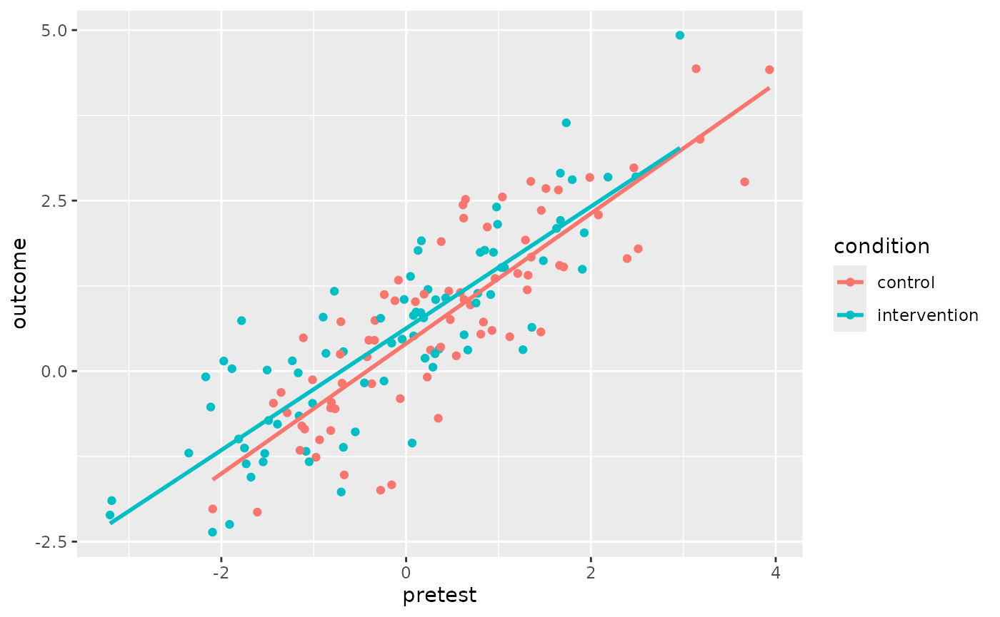
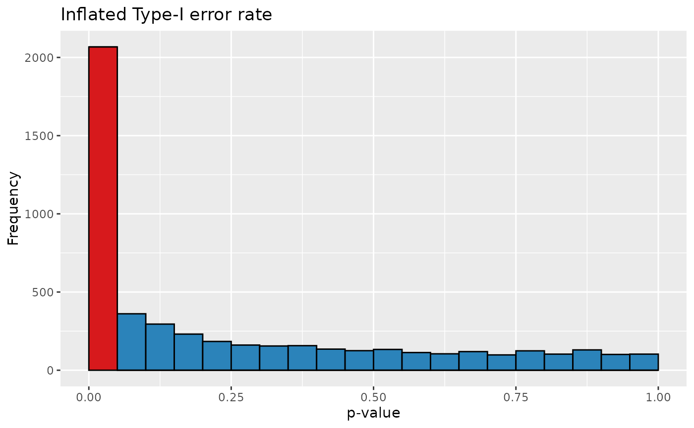
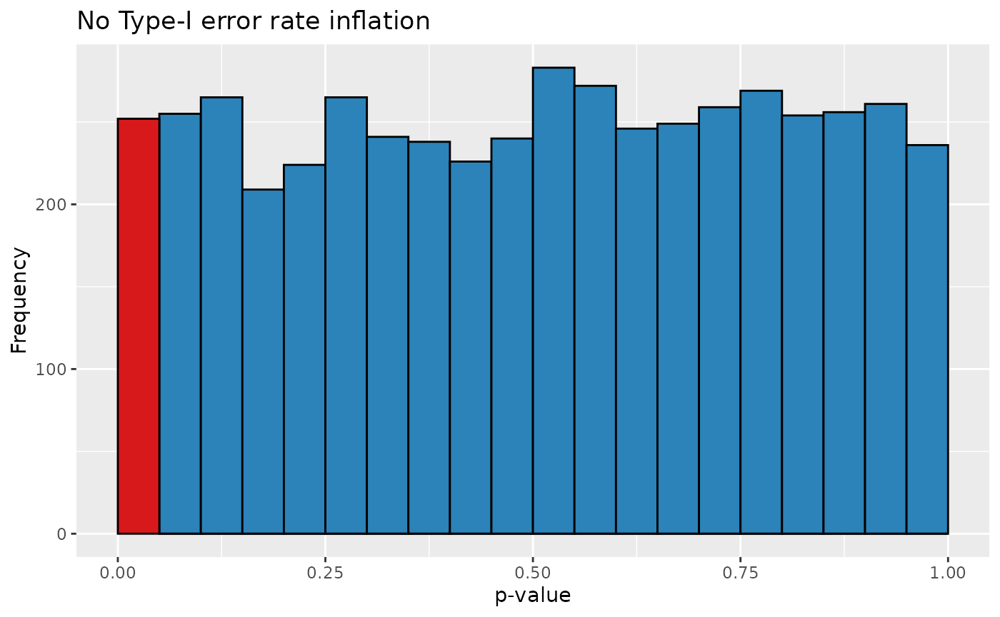

# Simulating and analysing cluster-randomised designs

The data from experiments in which entire clusters of participants
(e.g., classes) are assigned to the experimental conditions can’t be
analysed in the same way as data from experiments in which the
participants are assigned to the conditions individually. The function
[`clustered_data()`](https://janhove.github.io/cannonball/reference/clustered_data.md)
generates data for a cluster-randomised experiment and can be used to
demonstrate the increased Type-I error rate if such data are analysed
using t-tests on the individual outcomes. See [Vanhove
(2015)](http://doi.org/10.14746/ssllt.2015.5.1.7) for an introduction
geared towards applied linguists.

## Simulating cluster-randomised data

First load the package.

``` r

library(cannonball)
```

The `n_per_class` parameter specifies the number of pupils in each
simulated class. Half of the classes are assigned to the intervention
condition and half to the control condition.

``` r

d <- clustered_data(
  n_per_class <- c(17, 26, 14, 18, 19, 22, 17, 21),
  ICC = 0.25,
  effect = 0.3
)
d
#>     class    condition     outcome pretest
#> 1       1 intervention  1.67942590      NA
#> 2       1 intervention  1.10718657      NA
#> 3       1 intervention  1.52314405      NA
#> 4       1 intervention  0.27784191      NA
#> 5       1 intervention  1.38040997      NA
#> 6       1 intervention  0.86053364      NA
#> 7       1 intervention  2.66258862      NA
#> 8       1 intervention  0.24867657      NA
#> 9       1 intervention  1.02848899      NA
#> 10      1 intervention  1.44462190      NA
#> 11      1 intervention  1.75581606      NA
#> 12      1 intervention  3.38532738      NA
#> 13      1 intervention  0.74993293      NA
#> 14      1 intervention  0.55033618      NA
#> 15      1 intervention  1.11060854      NA
#> 16      1 intervention  1.80124294      NA
#> 17      1 intervention  1.59471957      NA
#> 18      2 intervention -0.31370590      NA
#> 19      2 intervention -0.54102394      NA
#> 20      2 intervention -0.36389342      NA
#> 21      2 intervention -0.81203426      NA
#> 22      2 intervention  0.16696623      NA
#> 23      2 intervention -0.52673237      NA
#> 24      2 intervention -0.26757197      NA
#> 25      2 intervention -0.02507939      NA
#> 26      2 intervention -1.99212227      NA
#> 27      2 intervention  0.21102987      NA
#> 28      2 intervention -0.23259112      NA
#> 29      2 intervention  0.31527921      NA
#> 30      2 intervention -0.49295657      NA
#> 31      2 intervention  1.46539050      NA
#> 32      2 intervention -0.73517933      NA
#> 33      2 intervention -1.50623285      NA
#> 34      2 intervention -0.98029749      NA
#> 35      2 intervention  1.08021536      NA
#> 36      2 intervention -0.64180036      NA
#> 37      2 intervention  1.03359740      NA
#> 38      2 intervention -0.01653603      NA
#> 39      2 intervention  0.95320654      NA
#> 40      2 intervention -0.71722147      NA
#> 41      2 intervention  0.49707872      NA
#> 42      2 intervention  0.47372555      NA
#> 43      2 intervention  1.03662339      NA
#> 44      3      control  1.17709706      NA
#> 45      3      control  1.24786825      NA
#> 46      3      control  0.03107657      NA
#> 47      3      control  0.78572161      NA
#> 48      3      control  0.37300007      NA
#> 49      3      control  0.19906938      NA
#> 50      3      control  1.42766307      NA
#> 51      3      control -0.64849887      NA
#> 52      3      control  0.76822601      NA
#> 53      3      control -0.83012772      NA
#> 54      3      control  0.45182698      NA
#> 55      3      control  1.48113977      NA
#> 56      3      control  0.22498900      NA
#> 57      3      control -0.66060888      NA
#> 58      4 intervention  1.44496081      NA
#> 59      4 intervention  2.84120934      NA
#> 60      4 intervention -0.83900077      NA
#> 61      4 intervention -1.67596104      NA
#> 62      4 intervention -0.61095778      NA
#> 63      4 intervention  1.01617936      NA
#> 64      4 intervention -0.66709120      NA
#> 65      4 intervention -0.67697678      NA
#> 66      4 intervention -0.32709435      NA
#> 67      4 intervention -0.56246388      NA
#> 68      4 intervention  1.49460676      NA
#> 69      4 intervention  1.01697481      NA
#> 70      4 intervention  0.31049028      NA
#> 71      4 intervention  2.68953313      NA
#> 72      4 intervention -0.68428725      NA
#> 73      4 intervention  0.69317801      NA
#> 74      4 intervention -0.60618643      NA
#> 75      4 intervention  1.69009766      NA
#> 76      5      control  0.09607811      NA
#> 77      5      control -0.81307323      NA
#> 78      5      control  0.05716141      NA
#> 79      5      control -1.95107268      NA
#> 80      5      control -2.00597098      NA
#> 81      5      control -1.82650344      NA
#> 82      5      control -1.26357833      NA
#> 83      5      control -1.55998681      NA
#> 84      5      control -1.04283058      NA
#> 85      5      control  0.63419822      NA
#> 86      5      control -1.85813138      NA
#> 87      5      control  0.16755737      NA
#> 88      5      control  2.81119736      NA
#> 89      5      control  1.03907811      NA
#> 90      5      control -2.43120123      NA
#> 91      5      control  0.47511085      NA
#> 92      5      control -1.38565499      NA
#> 93      5      control  1.01586053      NA
#> 94      5      control  0.19567858      NA
#> 95      6      control  2.58913773      NA
#> 96      6      control  3.56974989      NA
#> 97      6      control  2.14064583      NA
#> 98      6      control  2.15244935      NA
#> 99      6      control  0.34803842      NA
#> 100     6      control  1.83857145      NA
#> 101     6      control  1.84132591      NA
#> 102     6      control  3.48005688      NA
#> 103     6      control  2.57596109      NA
#> 104     6      control  0.65999240      NA
#> 105     6      control  1.15659248      NA
#> 106     6      control  1.73443521      NA
#> 107     6      control  1.20140181      NA
#> 108     6      control  1.48138265      NA
#> 109     6      control -0.68265182      NA
#> 110     6      control  1.10855608      NA
#> 111     6      control  1.89910027      NA
#> 112     6      control  2.13067232      NA
#> 113     6      control  0.72845353      NA
#> 114     6      control  1.22815108      NA
#> 115     6      control  1.78932714      NA
#> 116     6      control  3.18176125      NA
#> 117     7      control -1.07549220      NA
#> 118     7      control -0.21187136      NA
#> 119     7      control  2.10686346      NA
#> 120     7      control  1.26746936      NA
#> 121     7      control  0.68500666      NA
#> 122     7      control  0.28379129      NA
#> 123     7      control  1.06532289      NA
#> 124     7      control  2.17735700      NA
#> 125     7      control  2.42854984      NA
#> 126     7      control  0.95366314      NA
#> 127     7      control -0.90122933      NA
#> 128     7      control  1.28493883      NA
#> 129     7      control  0.69932422      NA
#> 130     7      control -1.29850966      NA
#> 131     7      control -0.35324936      NA
#> 132     7      control  1.77144299      NA
#> 133     7      control  0.83468166      NA
#> 134     8 intervention -1.69455976      NA
#> 135     8 intervention -1.21063748      NA
#> 136     8 intervention -0.13284609      NA
#> 137     8 intervention -1.03742831      NA
#> 138     8 intervention -0.67877652      NA
#> 139     8 intervention -0.72206877      NA
#> 140     8 intervention  1.05003772      NA
#> 141     8 intervention -0.53399279      NA
#> 142     8 intervention -2.07053028      NA
#> 143     8 intervention -0.11144444      NA
#> 144     8 intervention  0.68561495      NA
#> 145     8 intervention  2.06287013      NA
#> 146     8 intervention -0.84690331      NA
#> 147     8 intervention -1.76168512      NA
#> 148     8 intervention -0.86197354      NA
#> 149     8 intervention  0.89815131      NA
#> 150     8 intervention  1.92073100      NA
#> 151     8 intervention -0.83127243      NA
#> 152     8 intervention  0.96700071      NA
#> 153     8 intervention  0.72734008      NA
#> 154     8 intervention -2.03863201      NA
xtabs(~ class + condition, d)
#>      condition
#> class control intervention
#>     1       0           17
#>     2       0           26
#>     3      14            0
#>     4       0           18
#>     5      19            0
#>     6      22            0
#>     7      17            0
#>     8       0           21
```

I like to plot the outcomes of cluster-randomised experiments with a
continuous outcome like so:

``` r

library(ggplot2)
ggplot(data = d,
       aes(x = reorder(class, outcome, FUN = median),
           y = outcome)) +
  geom_boxplot(outlier.shape = NA) +
  geom_point(shape = 1,
             position = position_jitter(width = 0.2)) +
  facet_wrap(~ condition, scales = "free_x") +
  xlab("Class") +
  ylab("Outcome")
```



Or like so:

``` r

ggplot(data = d,
       aes(x = reorder(class, outcome, FUN = median),
           y = outcome)) +
  geom_boxplot(
    outlier.shape = NA,
    mapping = aes(fill = condition)
  ) +
  geom_point(shape = 1,
             position = position_jitter(width = 0.2)) +
  xlab("Class") +
  ylab("Outcome") +
  theme(legend.position = "bottom")
```



If you want to generate data for a cluster-randomised design that
includes a pretest, you can specify the desired population-level
correlation between the pretest scores and the non-intervention posttest
scores via the `rho_prepost` parameter:

``` r

d <- clustered_data(
  n_per_class <- c(17, 26, 14, 18, 19, 22, 17, 21),
  ICC = 0.25,
  effect = 0.3,
  rho_prepost = 0.8
)
#> 'rho_prepost' was set, so the 'reliability_pre' and 'reliability_post' were ignored, and both were set to the 'rho_prepost' value.
d
#>     class    condition     outcome     pretest
#> 1       1 intervention  0.73935377 -1.78115069
#> 2       1 intervention -1.17606249 -1.08330734
#> 3       1 intervention  2.02767998  1.92761127
#> 4       1 intervention  1.77244577  0.85066657
#> 5       1 intervention  3.64029098  1.73339725
#> 6       1 intervention  0.86533978  0.10825373
#> 7       1 intervention  4.92391409  2.96341681
#> 8       1 intervention  2.15271536  0.99024020
#> 9       1 intervention  1.49328980  1.90654309
#> 10      1 intervention  1.61909250  1.48479398
#> 11      1 intervention  1.74191036  0.94514694
#> 12      1 intervention  0.28526386 -0.67930426
#> 13      1 intervention  0.32340648  0.35818003
#> 14      1 intervention  2.84971605  2.48662903
#> 15      1 intervention  1.74181224  0.80203879
#> 16      1 intervention  1.19700068  0.23637566
#> 17      1 intervention  2.20950095  1.67047482
#> 18      2      control  2.28903523  2.08171408
#> 19      2      control  2.35679422  1.46309853
#> 20      2      control  1.15082404  0.58685052
#> 21      2      control  2.98081204  2.46491527
#> 22      2      control  0.45125737 -0.34232110
#> 23      2      control  1.52655902  1.70447407
#> 24      2      control -2.02126245 -2.09345472
#> 25      2      control  0.30946509  0.26480600
#> 26      2      control -0.55319861 -0.76922623
#> 27      2      control  0.72429532 -0.70597110
#> 28      2      control -0.85041359 -1.09775294
#> 29      2      control  4.43399512  3.13873901
#> 30      2      control -0.47023834 -1.43636113
#> 31      2      control  0.97040333  0.69536319
#> 32      2      control  0.54100834  0.80826884
#> 33      2      control -1.00705832 -0.93647218
#> 34      2      control  1.92133232  1.29130321
#> 35      2      control  0.71857230  0.83659159
#> 36      2      control  1.40557308  1.31969631
#> 37      2      control  0.75598946  0.47844092
#> 38      2      control -1.26299386 -0.97532584
#> 39      2      control  1.12186686 -0.23617801
#> 40      2      control  0.20940838 -0.42180780
#> 41      2      control  1.33355514 -0.08345958
#> 42      2      control  1.01791116  0.10060472
#> 43      2      control  0.59623533  0.92972267
#> 44      3      control -0.17727015 -0.69319753
#> 45      3      control  2.83971036  1.98757816
#> 46      3      control  1.43074470  1.20841729
#> 47      3      control  0.22500081  0.54339111
#> 48      3      control  1.54994970  1.66124689
#> 49      3      control -0.61079161 -1.28759076
#> 50      3      control  1.35845079  0.96295584
#> 51      3      control -0.40269242 -0.06351061
#> 52      3      control  1.64950372  2.39212185
#> 53      3      control -0.12700047 -1.01282031
#> 54      3      control  0.57380771  1.45879408
#> 55      3      control  0.45335899 -0.40368941
#> 56      3      control -0.18504864 -0.37217173
#> 57      3      control  2.11273552  0.87859725
#> 58      4      control  2.24228433  0.62302772
#> 59      4      control -2.06703139 -1.60994652
#> 60      4      control -0.87150035 -0.81604151
#> 61      4      control  2.51847495  0.64252755
#> 62      4      control  0.35196810  0.37415668
#> 63      4      control  1.89930595  0.37988269
#> 64      4      control -1.52219235 -0.66982141
#> 65      4      control  1.19105714  1.31079382
#> 66      4      control  1.03187129 -0.12087926
#> 67      4      control -0.53948971 -0.81680220
#> 68      4      control -0.08733416  0.22883494
#> 69      4      control  0.74277280 -0.33727980
#> 70      4      control -1.66756012 -0.15589172
#> 71      4      control -1.16124715 -1.14895096
#> 72      4      control -0.80337403 -1.12832353
#> 73      4      control  0.48783655 -1.11215742
#> 74      4      control  1.12790146  0.19449912
#> 75      4      control -1.74596121 -0.27599533
#> 76      5 intervention  0.14743135 -1.97375449
#> 77      5 intervention -0.99540241 -1.81245798
#> 78      5 intervention -1.12769960 -1.74960022
#> 79      5 intervention  1.04748174  0.31932673
#> 80      5 intervention  0.77515288 -0.27608728
#> 81      5 intervention -1.20211635 -2.35227050
#> 82      5 intervention  0.15032903 -1.23137468
#> 83      5 intervention -1.35970786 -1.73081905
#> 84      5 intervention -0.52673634 -2.11467837
#> 85      5 intervention -2.10969615 -3.20473842
#> 86      5 intervention  2.09238015  1.62813416
#> 87      5 intervention -1.20710602 -1.52962159
#> 88      5 intervention  0.18887936  0.20440398
#> 89      5 intervention -0.47222939 -1.01252195
#> 90      5 intervention -1.77223553 -0.70222138
#> 91      5 intervention -1.89876708 -3.18592636
#> 92      5 intervention -0.65716847 -1.15826121
#> 93      5 intervention -1.11759421 -0.67894631
#> 94      5 intervention -0.08437734 -2.16912828
#> 95      6 intervention  2.80665329  1.79764723
#> 96      6 intervention  2.84432374  2.18466325
#> 97      6 intervention  0.64210271  1.36101201
#> 98      6 intervention  1.51742985  1.03272970
#> 99      6 intervention  0.78056828  0.18940677
#> 100     6 intervention  0.99896091  0.75648734
#> 101     6 intervention -0.77797521 -1.39278061
#> 102     6 intervention  0.31370927  1.26435478
#> 103     6 intervention  0.46909557 -0.04362219
#> 104     6 intervention  0.85682051  0.15923693
#> 105     6 intervention  0.53260175  0.62803388
#> 106     6 intervention -1.33064896 -1.54744429
#> 107     6 intervention  1.05083184 -0.02156776
#> 108     6 intervention  1.12256111  0.91516721
#> 109     6 intervention -0.17283712 -0.45164048
#> 110     6 intervention  0.51624551  0.08181274
#> 111     6 intervention  0.01541753 -1.50470861
#> 112     6 intervention -1.32915272 -1.04966890
#> 113     6 intervention  0.30958107  0.66740151
#> 114     6 intervention  2.90211702  1.66924665
#> 115     6 intervention -0.89118983 -0.55019267
#> 116     6 intervention  0.03488696 -1.88477862
#> 117     7      control  2.67696450  1.51290222
#> 118     7      control  1.67068918  1.35336262
#> 119     7      control  2.77452590  3.66454887
#> 120     7      control  1.17230987  0.46173146
#> 121     7      control -0.69131474  0.34779021
#> 122     7      control  2.65614223  1.64829978
#> 123     7      control  2.55313690  1.04192731
#> 124     7      control  2.43720891  0.61553267
#> 125     7      control  1.04885725  0.62705985
#> 126     7      control  2.78096592  1.34893618
#> 127     7      control  3.39886405  3.18100280
#> 128     7      control  4.41918788  3.93322595
#> 129     7      control -0.45857404 -0.80838171
#> 130     7      control  0.50360676  1.12186833
#> 131     7      control  0.24842498 -0.71321922
#> 132     7      control  1.79347223  2.51160394
#> 133     7      control -0.31298333 -1.35339386
#> 134     8 intervention  1.07308520  0.42800792
#> 135     8 intervention  0.41082969 -0.15629086
#> 136     8 intervention  0.81476356  0.07922407
#> 137     8 intervention -0.72467470 -1.48848940
#> 138     8 intervention -1.55454771 -1.67913529
#> 139     8 intervention -1.05504086  0.06505446
#> 140     8 intervention -0.14521355 -0.23917695
#> 141     8 intervention  0.05779565  0.28985211
#> 142     8 intervention  1.14030784  0.77552384
#> 143     8 intervention -0.02593171 -1.16806745
#> 144     8 intervention  2.40562528  0.97887232
#> 145     8 intervention -2.24744085 -1.91069847
#> 146     8 intervention  0.25523506  0.31276702
#> 147     8 intervention  1.76922569  0.12925028
#> 148     8 intervention  0.79122240 -0.89793025
#> 149     8 intervention  1.17077205 -0.77665206
#> 150     8 intervention  1.91059590  0.16545403
#> 151     8 intervention -2.36166942 -2.09552550
#> 152     8 intervention  1.51717867  1.06397052
#> 153     8 intervention  0.26047935 -0.86817259
#> 154     8 intervention  1.38846141  0.04737750
```

``` r

ggplot(
  d,
  aes(x = pretest, y = outcome,
      colour = condition) 
) +
  geom_point() +
  geom_smooth(method = "lm", se = FALSE)
#> `geom_smooth()` using formula = 'y ~ x'
```



See [Vanhove (2020)](https://doi.org/10.31234/osf.io/ef4zc) for more
information on leveraging pretest scores (and covariates in general)
when designing and analysing data from cluster-randomised designs.

## Evaluating the Type-I error rate of naive analysis

To drive the point home that the data from clustered-randomised designs
can’t ignore the clustered nature of the data, we can run a simulation
that generates a couple of thousand such data sets and analyses them
using a t-test on the pupils:

``` r

class_n <- c(17, 26, 14, 18, 19, 22, 17, 21)
ps <- replicate(
  5000,
  {
    d <- clustered_data(n_per_class = class_n, ICC = 0.25, effect = 0)
    t.test(outcome ~ condition, data = d, var.equal = TRUE)$p.value
  }
)
```

The Type-I error rate for these settings is over 40% as opposed to the
nominal 5% (when using $`\alpha = 0.05`$):

``` r

data.frame(p = ps) |> 
  ggplot(aes(x = ps)) +
  geom_histogram(breaks = seq(0, 1, 0.05),
                 colour = "black",
                 mapping = aes(fill = ps < 0.05)) +
  scale_fill_manual(values = c("#2b83ba", "#d7191c")) +
  xlab("p-value") +
  ylab("Frequency") +
  ggtitle("Inflated Type-I error rate") +
  theme(legend.position = "none")
```



## A correct analysis

One possible way to analyse cluster-randomised data correctly is to
average the outcomes per cluster and then just analyse these cluster
averages.

``` r

d <- clustered_data(
  n_per_class <- c(17, 26, 14, 18, 19, 22, 17, 21),
  ICC = 0.25,
  effect = 0.3
)
d_per_class <- aggregate(d$outcome, 
                         by = list(condition = d$condition, class = d$class), 
                         mean)
d_per_class
#>      condition class          x
#> 1 intervention     1 0.07700714
#> 2 intervention     2 1.28364777
#> 3      control     3 0.79503307
#> 4 intervention     4 1.10408133
#> 5      control     5 0.35637627
#> 6      control     6 1.16764482
#> 7      control     7 1.73740742
#> 8 intervention     8 0.52379410
```

``` r

t.test(x ~ condition, d_per_class, var.equal = TRUE)
#> 
#>  Two Sample t-test
#> 
#> data:  x by condition
#> t = 0.66374, df = 6, p-value = 0.5315
#> alternative hypothesis: true difference in means between group control and group intervention is not equal to 0
#> 95 percent confidence interval:
#>  -0.7172593  1.2512249
#> sample estimates:
#>      mean in group control mean in group intervention 
#>                  1.0141154                  0.7471326
```

We can verify that this analysis is valid using a simulation:

``` r

ps <- replicate(
  5000,
  {
    d <- clustered_data(n_per_class = class_n, ICC = 0.25, effect = 0)
    d_per_class <- aggregate(d$outcome, 
      by = list(condition = d$condition, class = d$class), mean)
    t.test(x ~ condition, data = d_per_class, var.equal = TRUE)$p.value
  }
)
data.frame(p = ps) |> 
  ggplot(aes(x = ps)) +
  geom_histogram(breaks = seq(0, 1, 0.05),
                 colour = "black",
                 mapping = aes(fill = ps < 0.05)) +
  scale_fill_manual(values = c("#2b83ba", "#d7191c")) +
  xlab("p-value") +
  ylab("Frequency") +
  ggtitle("No Type-I error rate inflation") +
  theme(legend.position = "none")
```



## References

Vanhove, Jan.  2015. [Analyzing randomized controlled interventions:
Three notes for applied
linguists.](http://doi.org/10.14746/ssllt.2015.5.1.7) *Studies in Second
Language Learning and Teaching* 5(1). 135–152. (Also see the [correction
note](http://pressto.amu.edu.pl/index.php/ssllt/article/view/5827/5895)
for this article.)

Vanhove, Jan. 2020. [Capitalising on covariates in cluster-randomised
experiments.](https://doi.org/10.31234/osf.io/ef4zc) *PsyArXiv
Preprints*.
