# Randomisation testing

When explaining p-values, I like to use randomisation tests rather than
t-tests or F-tests or what-have-you as their assumptions are easier to
verify and you don’t need a lot of maths to run them. See the blog post
[*The population model and the randomisation model of statistical
inference*](https://janhove.github.io/posts/2025-11-09-population-randomisation/)
for some background.

``` r

library(cannonball)
```

## Exhaustive rerandomisation

Let’s create a fictitious dataset of an experiment in which 18
participants were randomly assigned to one of two groups (9 participants
per group). These data are just randomly drawn numbers between 1 and 20
for both conditions.

``` r

d <- data.frame(
  outcome = sample(1:20, size = 18, replace = TRUE),
  group = rep(c("control", "treatment"), each = 9)
)
boxplot(outcome ~ group, d)
```

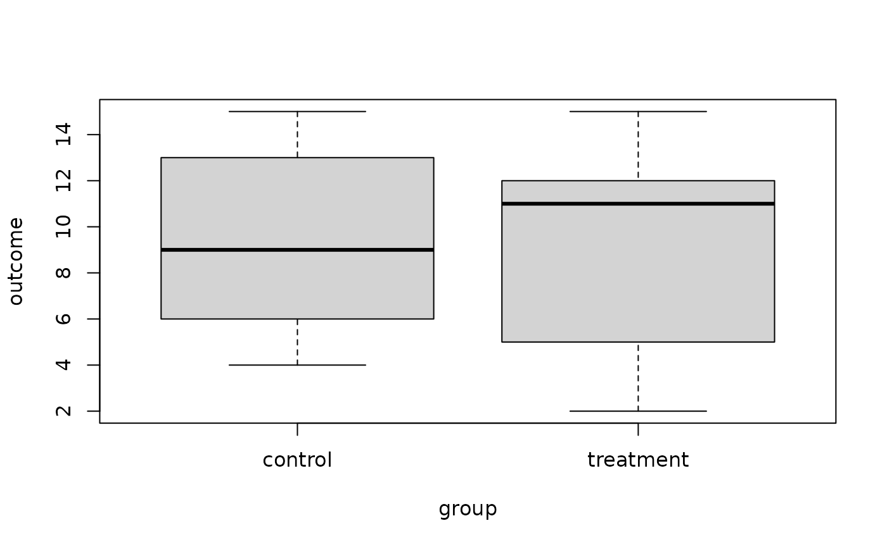

By default, the function
[`rand_test()`](https://janhove.github.io/cannonball/reference/rand_test.md)
computes *p*-values between two conditions using exhausitive
rerandomisation. Its `outcome` parameter takes the outcome data; the
`treatment_idx` parameter takes the indices of the treatment group
(obtained below using [`which()`](https://rdrr.io/r/base/which.html)),
and the `statistic` parameter specifies which test statistic should be
used. To compute *p*-values for the **mean difference**, we proceed as
follows:

``` r

rand_test(d$outcome, which(d$group == "treatment"), statistic = mean_diff)
```

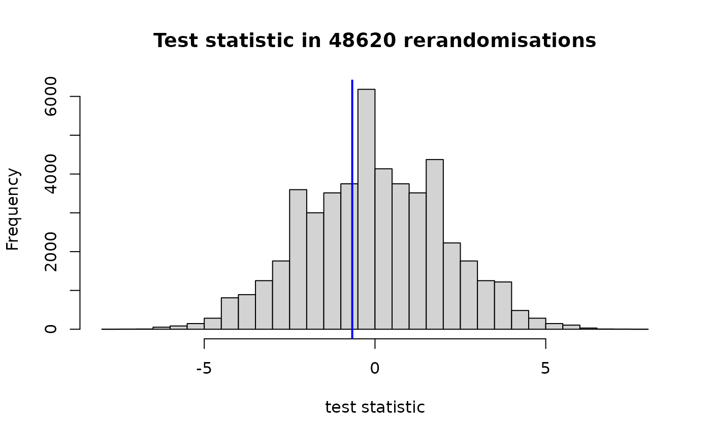

    #> $`left-sided p-value`
    #> [1] 0.3938914
    #> 
    #> $`right-sided p-value`
    #> [1] 0.6450843
    #> 
    #> $`two-sided p-value`
    #> [1] 0.7877828

In the histogram, the observed test statistic is highlighted by the blue
vertical line.

Instead, we could have run a test on the difference between the
condition medians like so:

``` r

rand_test(d$outcome, which(d$group == "treatment"), statistic = median_diff)
```

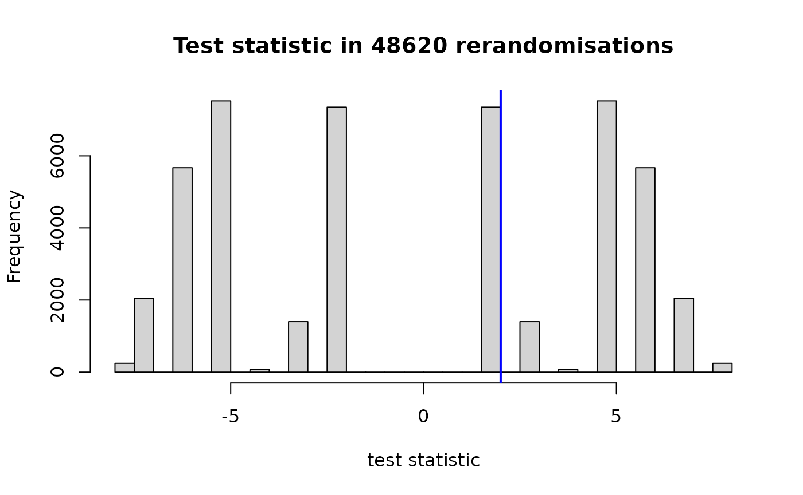

    #> $`left-sided p-value`
    #> [1] 0.6511724
    #> 
    #> $`right-sided p-value`
    #> [1] 0.5
    #> 
    #> $`two-sided p-value`
    #> [1] 1

Some further test statistics are predefined (see
[`?test_statistics`](https://janhove.github.io/cannonball/reference/test_statistics.md)),
e.g., the probability of superiority

``` r

rand_test(d$outcome, which(d$group == "treatment"), statistic = prob_super)
```

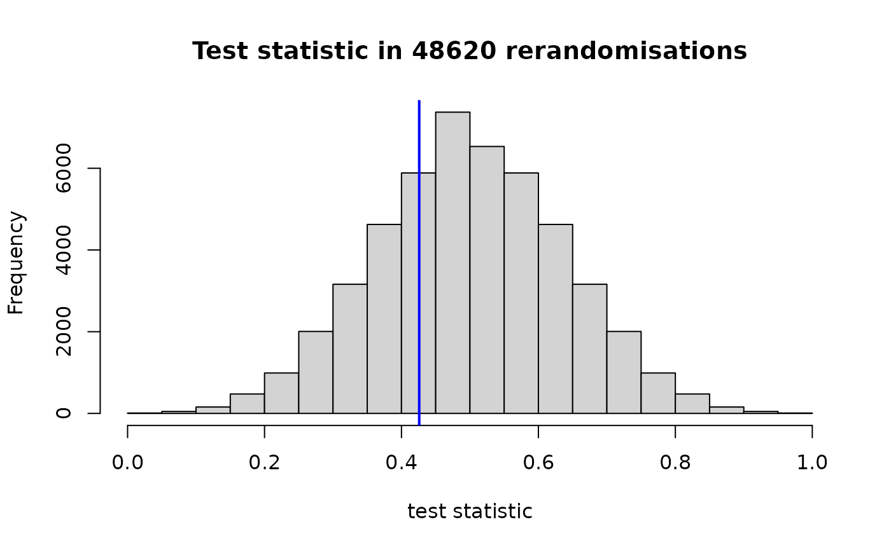

    #> $`left-sided p-value`
    #> [1] 0.3083916
    #> 
    #> $`right-sided p-value`
    #> [1] 0.7065817
    #> 
    #> $`two-sided p-value`
    #> [1] 0.6167832

or the studentised mean difference:

``` r

rand_test(d$outcome, which(d$group == "treatment"), statistic = stud_mean_diff)
```

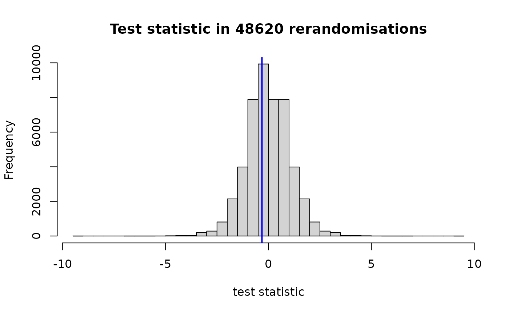

    #> $`left-sided p-value`
    #> [1] 0.3938914
    #> 
    #> $`right-sided p-value`
    #> [1] 0.6450843
    #> 
    #> $`two-sided p-value`
    #> [1] 0.7877828

You can also adapt the
[`mean_diff()`](https://janhove.github.io/cannonball/reference/test_statistics.md)
so that it works for, say, trimmed means:

``` r

trimmed_mean_diff <- function(outcome, treatment_idx) {
  mean(outcome[treatment_idx], trim = 0.1) - mean(outcome[-treatment_idx], trim = 0.1)
}
rand_test(d$outcome, which(d$group == "treatment"), statistic = trimmed_mean_diff)
```


    #> $`left-sided p-value`
    #> [1] 0.3938914
    #> 
    #> $`right-sided p-value`
    #> [1] 0.6450843
    #> 
    #> $`two-sided p-value`
    #> [1] 0.7877828

### Unequal group sizes

Nothing hinges on the group sizes being equal. Here’s an example with
group sizes 7 and 11 instead of 9 and 9.

``` r

d <- data.frame(
  outcome = sample(1:20, size = 18, replace = TRUE),
  group = rep(c("control", "treatment"), times = c(7, 11))
)
boxplot(outcome ~ group, d)
```

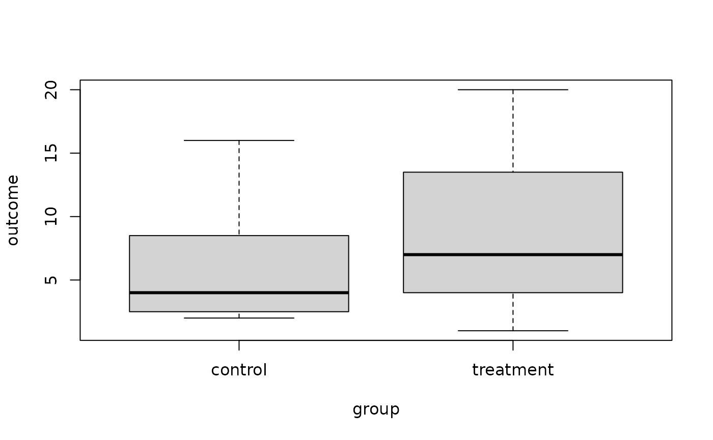

``` r

rand_test(d$outcome, which(d$group == "treatment"), statistic = stud_mean_diff)
```

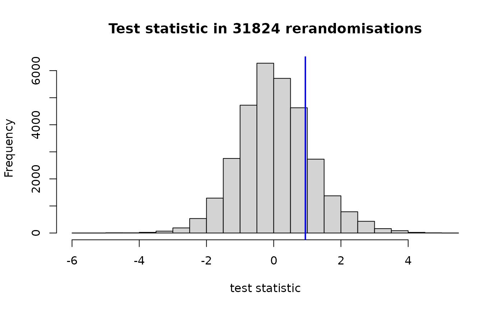

    #> $`left-sided p-value`
    #> [1] 0.8112745
    #> 
    #> $`right-sided p-value`
    #> [1] 0.1892911
    #> 
    #> $`two-sided p-value`
    #> [1] 0.3785822

## Monte Carlo rerandomisation

For larger group sizes, we need to use the Monte Carlo method instead.
This, too, is implemented in the
[`rand_test()`](https://janhove.github.io/cannonball/reference/rand_test.md)
function. To illustrate its use, we’ll use part of a dataset of a study
I once ran. It was hypothesised that the participant in the *ij-ei*
condition would obtain higher scores than those in the *oe-u* condition.

``` r

d <- structure(list(Subject = c("S10", "S100", "S11", "S12", "S14", 
"S15", "S16", "S18", "S2", "S20", "S21", "S22", "S23", "S25", 
"S28", "S29", "S3", "S32", "S33", "S34", "S35", "S36", "S37", 
"S38", "S39", "S4", "S40", "S41", "S42", "S43", "S44", "S45", 
"S47", "S48", "S49", "S5", "S50", "S51", "S52", "S53", "S54", 
"S55", "S56", "S57", "S58", "S59", "S6", "S60", "S61", "S62", 
"S63", "S64", "S66", "S67", "S68", "S69", "S7", "S70", "S71", 
"S73", "S74", "S76", "S77", "S78", "S79", "S8", "S80", "S81", 
"S82", "S83", "S85", "S86", "S88", "S89", "S90", "S91", "S93", 
"S94", "S96", "S97"), LearningCondition = c("oe-u", "ij-ei", 
"oe-u", "ij-ei", "ij-ei", "oe-u", "ij-ei", "ij-ei", "oe-u", "oe-u", 
"ij-ei", "oe-u", "ij-ei", "ij-ei", "oe-u", "ij-ei", "ij-ei", 
"oe-u", "ij-ei", "ij-ei", "oe-u", "ij-ei", "ij-ei", "oe-u", "ij-ei", 
"ij-ei", "ij-ei", "ij-ei", "oe-u", "oe-u", "ij-ei", "ij-ei", 
"ij-ei", "oe-u", "oe-u", "oe-u", "ij-ei", "ij-ei", "ij-ei", "ij-ei", 
"oe-u", "oe-u", "ij-ei", "oe-u", "oe-u", "oe-u", "oe-u", "oe-u", 
"ij-ei", "oe-u", "ij-ei", "ij-ei", "oe-u", "oe-u", "oe-u", "ij-ei", 
"ij-ei", "ij-ei", "ij-ei", "ij-ei", "oe-u", "ij-ei", "oe-u", 
"ij-ei", "oe-u", "ij-ei", "oe-u", "oe-u", "oe-u", "oe-u", "oe-u", 
"ij-ei", "oe-u", "oe-u", "ij-ei", "ij-ei", "ij-ei", "ij-ei", 
"ij-ei", "oe-u"), PropCorrect = c(0.19047619047619, 0.380952380952381, 
0.285714285714286, 0.523809523809524, 0.285714285714286, 0.142857142857143, 
0.428571428571429, 0.80952380952381, 0.0952380952380952, 0.0952380952380952, 
0.19047619047619, 0.0952380952380952, 0.714285714285714, 0.285714285714286, 
0.0952380952380952, 0.238095238095238, 0.19047619047619, 0.619047619047619, 
0.666666666666667, 0.238095238095238, 0.428571428571429, 0.142857142857143, 
0.333333333333333, 0.761904761904762, 0.19047619047619, 0.714285714285714, 
0.571428571428571, 0.666666666666667, 0.428571428571429, 0.238095238095238, 
0.904761904761905, 0.333333333333333, 0.380952380952381, 0.238095238095238, 
0.476190476190476, 0.285714285714286, 0.380952380952381, 0.714285714285714, 
0.761904761904762, 0.142857142857143, 0.333333333333333, 0.333333333333333, 
0.333333333333333, 0.285714285714286, 0.380952380952381, 0.238095238095238, 
0.333333333333333, 0.476190476190476, 0.333333333333333, 0, 0.714285714285714, 
0.333333333333333, 0.142857142857143, 0.333333333333333, 0.333333333333333, 
0.476190476190476, 0.666666666666667, 0.714285714285714, 0.523809523809524, 
0.0952380952380952, 0.380952380952381, 0.333333333333333, 0.142857142857143, 
0.80952380952381, 0.238095238095238, 0.333333333333333, 0.285714285714286, 
0.619047619047619, 0.285714285714286, 0.142857142857143, 0.19047619047619, 
0.333333333333333, 0.333333333333333, 0.142857142857143, 0.571428571428571, 
0.333333333333333, 0.428571428571429, 0.142857142857143, 0.0952380952380952, 
0.285714285714286)), class = "data.frame", row.names = c(NA, 
-80L))

boxplot(PropCorrect ~ LearningCondition, d)
```

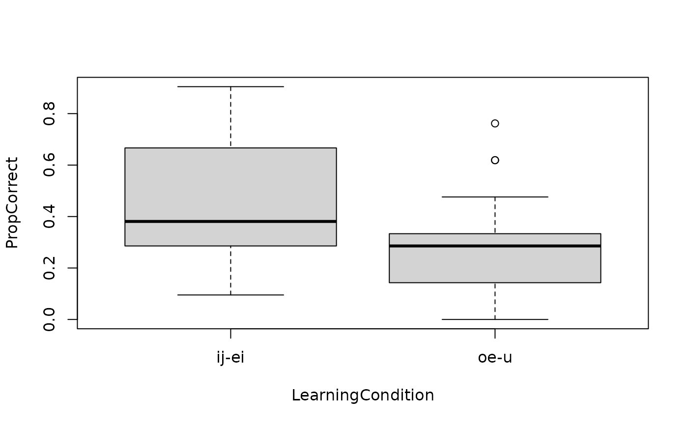

Use `exact = FALSE` to use the Monte Carlo method. By default, 20000
reallocations are generated (including the one actually obtained); you
can change this number via the `M` parameter:

``` r

rand_test(d$PropCorrect, which(d$LearningCondition == "ij-ei"),
          statistic = prob_super, exact = FALSE)
```

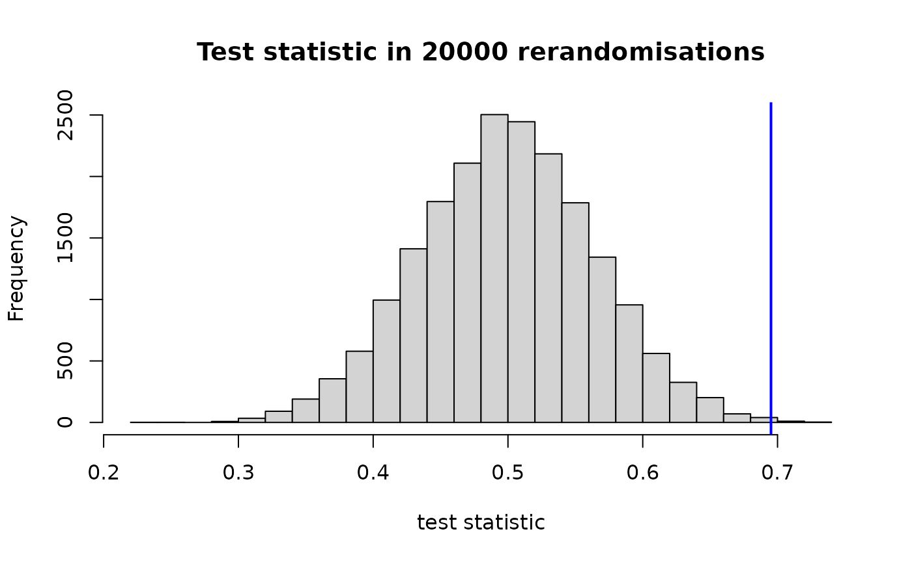

    #> $`left-sided p-value`
    #> [1] 0.9991
    #> 
    #> $`right-sided p-value`
    #> [1] 0.00095
    #> 
    #> $`two-sided p-value`
    #> [1] 0.0019

## Randomisation tests for blocked designs

The following fictitious dataset comprises 32 participants arranged in
16 blocks of two participants each:

``` r

d <- structure(list(Block = c(1L, 1L, 2L, 2L, 3L, 3L, 4L, 4L, 5L, 
5L, 6L, 6L, 7L, 7L, 8L, 8L, 9L, 9L, 10L, 10L, 11L, 11L, 12L, 
12L, 13L, 13L, 14L, 14L, 15L, 15L, 16L, 16L), Condition = c("intervention", 
"control", "control", "intervention", "control", "intervention", 
"control", "intervention", "intervention", "control", "intervention", 
"control", "control", "intervention", "control", "intervention", 
"control", "intervention", "intervention", "control", "intervention", 
"control", "control", "intervention", "control", "intervention", 
"control", "intervention", "control", "intervention", "control", 
"intervention"), Score = c(-3.0784700250814, -2.04185038339847, 
-1.85824556248386, -0.452891923289946, -0.399630796930755, -0.313966460118076, 
-0.619142676095193, -0.404472103693484, -0.0675902401328488, 
-0.537182166683201, 1.15210580663099, -0.43374079035467, -0.344900313631999, 
0.592759164907358, 0.963498630361429, 0.109796850196813, 0.0415642494470597, 
0.784497826488234, 0.670044380232945, 0.590323107343662, 0.584706784669443, 
0.0419887429871804, 1.11284211831769, 1.7750932157465, 1.40609979493584, 
1.35469666637164, 0.716270504357298, 1.57743794034306, 1.42362181491362, 
1.36480038789931, 2.10757857807719, 2.36684343696841)), class = "data.frame", row.names = c(NA, 
-32L))

library(ggplot2)
ggplot(d,
       aes(x = Score, y = reorder(factor(Block), Score),
           shape = Condition)) +
  geom_point() +
  scale_shape_manual(values = c(1, 3)) +
  xlab("Outcome") +
  ylab("Block") +
  theme(legend.position = "bottom")
```

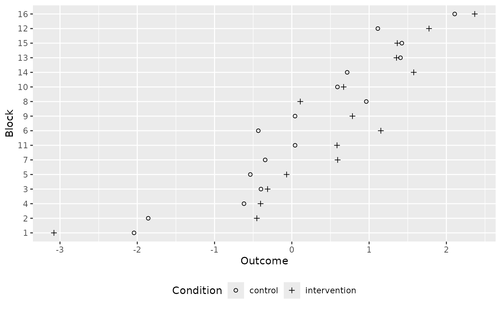

We can use the
[`rand_test()`](https://janhove.github.io/cannonball/reference/rand_test.md)
function and specify the `block` parameter to run a randomisation test
that takes the blocking structure into account.

``` r

rand_test(d$Score, which(d$Condition == "intervention"), d$Block, 
          statistic = mean_diff)
```

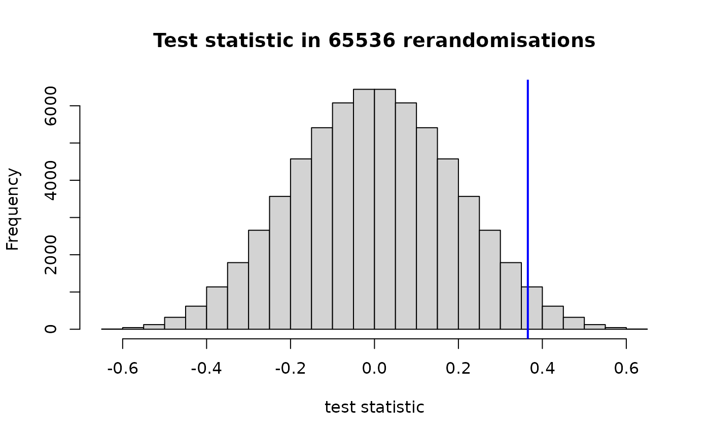

    #> $`left-sided p-value`
    #> [1] 0.9717407
    #> 
    #> $`right-sided p-value`
    #> [1] 0.02827454
    #> 
    #> $`two-sided p-value`
    #> [1] 0.05654907

If there are many blocks (perhaps 17 or more), we need to use the Monte
Carlo method instead:

``` r

rand_test(d$Score, which(d$Condition == "intervention"), d$Block, 
  statistic = mean_diff, exact = FALSE)
```

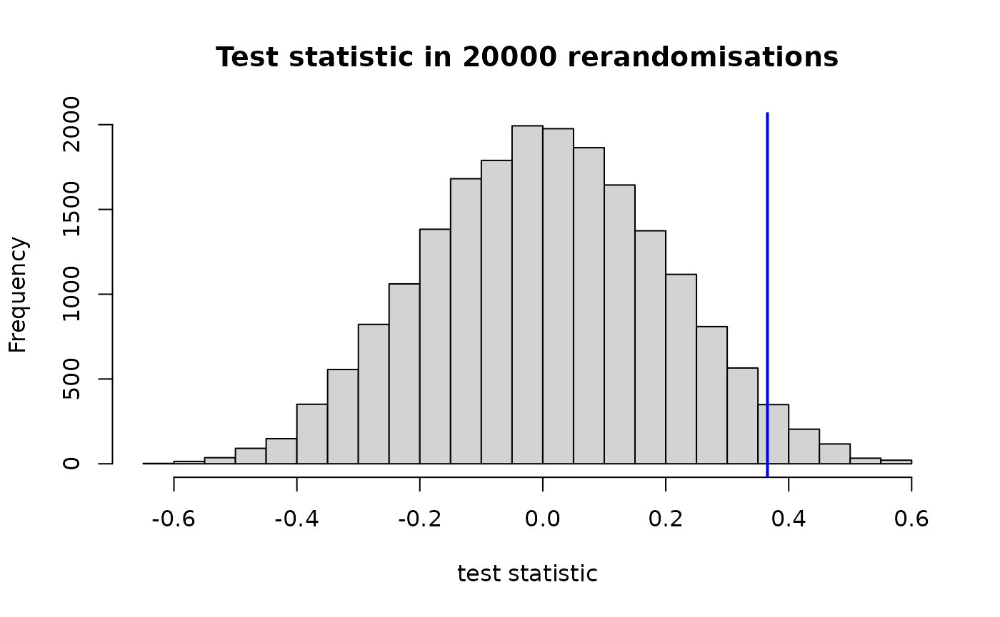

    #> $`left-sided p-value`
    #> [1] 0.9692
    #> 
    #> $`right-sided p-value`
    #> [1] 0.03085
    #> 
    #> $`two-sided p-value`
    #> [1] 0.0617
