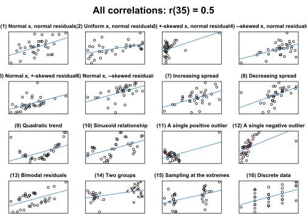

# cannonball

cannonball bundles a couple of functions that I use when teaching
introductory courses in quantitative methodology and statistics.

## Installation

You can install cannonball from Github with:

``` r

pak::pak("janhove/cannonball")
```

## Functions

``` r

# Load the package
library(cannonball)
```

### `plot_r()`: Draw different scatterplots with the same correlation coefficient

A single correlation coefficient can correspond to any number of
scatterplots.
[`plot_r()`](https://janhove.github.io/cannonball/reference/plot_r.md)
produces 16 such scatterplots for any given Pearson correlation
coefficient to drive this point home.

``` r

plot_r(r = 0.5, n = 35)
```



For more info, see
[`?plot_r`](https://janhove.github.io/cannonball/reference/plot_r.md).

Accompanying blog post: [*What data patterns can lie behind a
correlation
coefficient?*](https://janhove.github.io/posts/2016-11-21-what-correlations-look-like/)

### Walkthroughs

To help students see the connection between an experiment’s design and
its analysis, I’ve written two functions.

[`walkthrough_p()`](https://janhove.github.io/cannonball/reference/walkthrough_p.md)
guides the user through a completely randomised experiment: Data points
are generated and randomly assigned to either the control or
intervention condition. Then, the intervention effect is added to the
data points in the intervention condition. Finally, the data are
analysed using a randomisation test.

``` r

# see ?walkthrough_p
walkthrough_p(n = 18, diff = 0.3, sd = 1,)
```

[`walkthrough_blocking()`](https://janhove.github.io/cannonball/reference/walkthrough_blocking.md)
works similarly to
[`walkthrough_p()`](https://janhove.github.io/cannonball/reference/walkthrough_p.md)
but describes a randomised block design: Prior information about the
data points is available in the form of a covariate (e.g., a pretest
score). This information is used to group participants into ‘blocks’,
and the randomisation is restricted in that one participant per block is
assigned to the control and one to the intervention condition.
Crucially, the analysis needs to take this restricted randomisation into
account.

``` r

# ?walkthrough_blocking
walkthrough_blocking(n = 12, diff = 0.4, sd = 1)
```

### Simulate data and analysed cluster-randomised data

The data from experiments in which entire clusters of participants
(e.g., classes) are assigned to the experimental conditions can’t be
analysed in the same way as data from experiments in which the
participants are assigned to the conditions individually.
[`clustered_data()`](https://janhove.github.io/cannonball/reference/clustered_data.md)
generates data for a cluster-randomised experiment and can be used to
demonstrate the increased Type-I error rate if such data are analysed
using t-tests on the individual outcomes.

Refer to the vignette (article)
[`vignette("cluster-randomisation", package = "cannonball")`](https://janhove.github.io/cannonball/articles/cluster-randomisation.md)
for details.

### Check model assumptions graphically

These functions may be helpful for helping you to judge whether your
data conform to the assumptions of your statistical model. By embedding
the model’s diagnostic plot in a line-up of diagnostic plots of
simulated data for which the model’s assumptions are literally met,
analysts can more easily determine whether any blips in these plots are
indicative of assumption violations or whether they can plausibly be
accounted for by sampling error/noise.

Refer to the vignette (article)
[`vignette("check-assumptions", package = "cannonball")`](https://janhove.github.io/cannonball/articles/check-assumptions.md)
for details.
